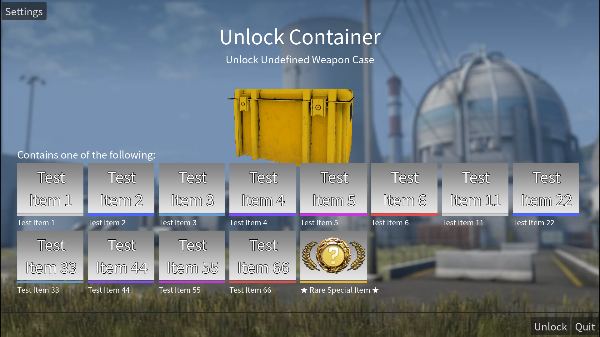

# CS2 Case Randomizer

A random chooser with CS2 case unlock theme<br>
Made with Godot Engine 4 .NET 8

# How to use
Create a ```.csv``` file<br>
First column is name, second column is quality<br>
Quality is ```0-5```, and ```6``` is ```Rare Special Item```<br>
Import the file in Settings

Put a ```CaseLogo.png``` next to the ```exe``` file<br>
can add a logo onto the front of the case<br>
If you want to change scale of it, add a ```CaseLogo.json``` next to it

# CaseLogo.json
```
{
	"scale_x":1,
	"scale_y":1,
	"scale_z":1
}
```